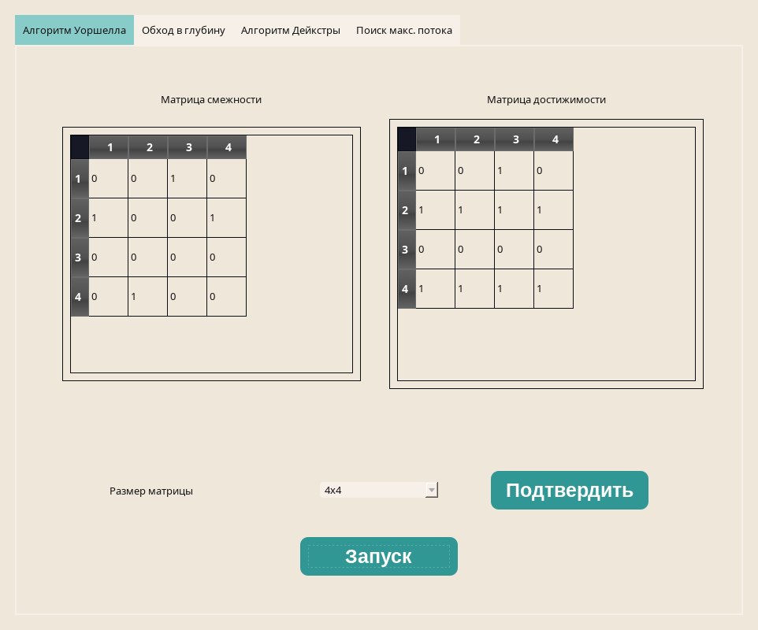
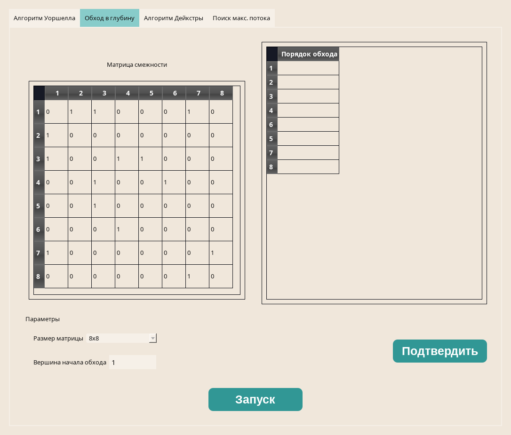
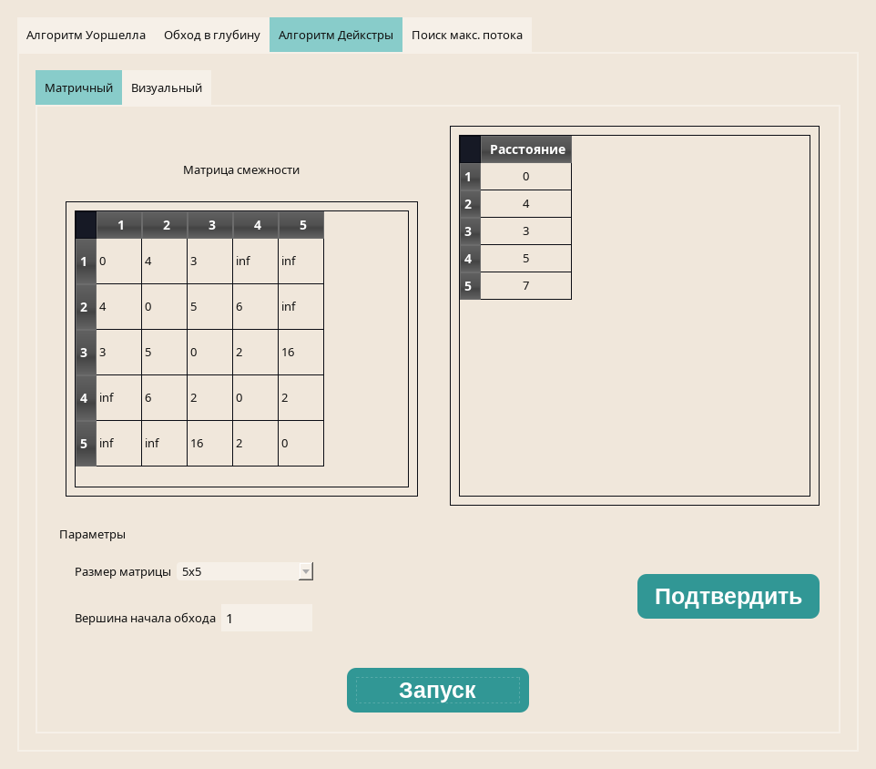
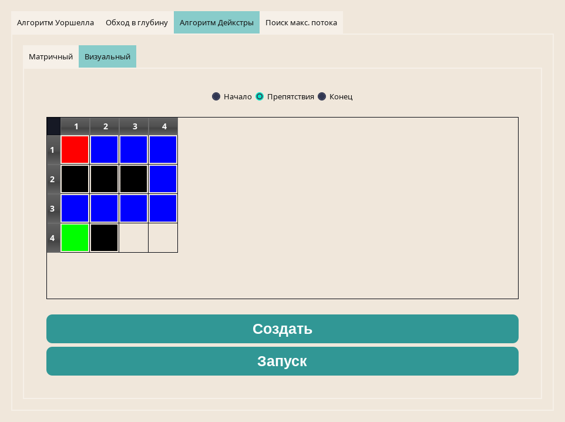
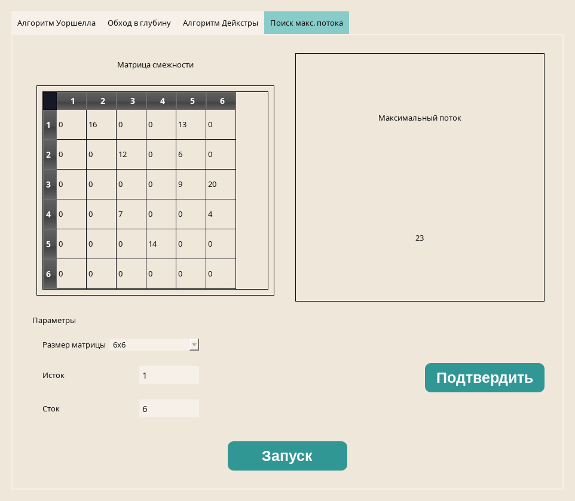

# graph-algorithms

The C++/Qt Study project of graph algorithms

---

**This project includes:**

* _Warshall algorithm_
* _Depth-first search algorithm_
* _Dijkstra's algorithm_
* _Ford-Fulkerson algorithm for maximum flow problem_

## Warshall algorithm

## Depth-first search algorithm

## Dijkstra's algorithm

* green - start point
* red - end point
* black - barriers

## Ford-Fulkerson algorithm

### _Remarque:_

The project contains a lot of bugs and there is no error handling
